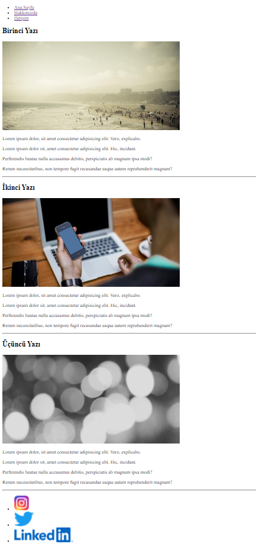
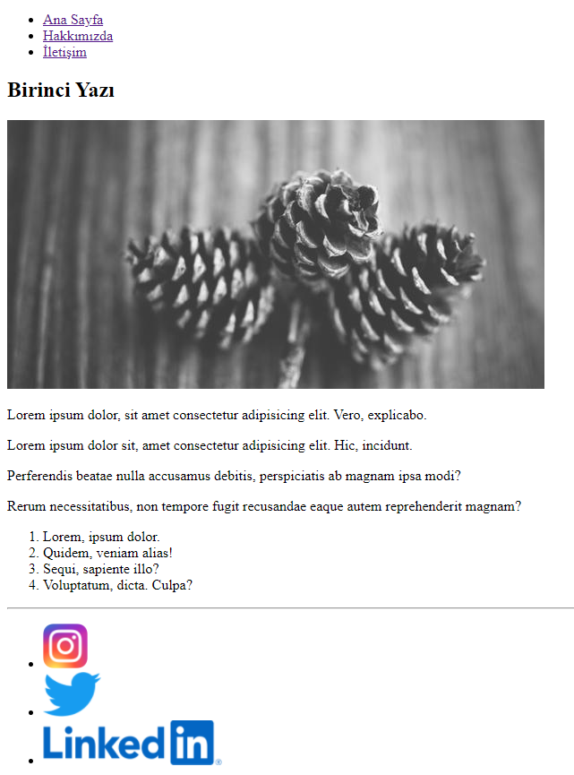
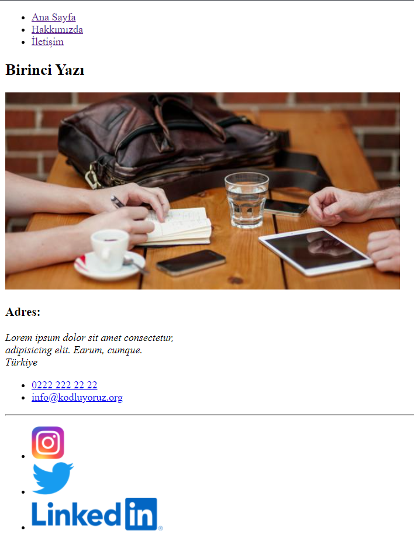

# kodluyoruzFrontEnd

Bu repo [Kodluyoruz](https://www.kodluyoruz.org/) Front-End Eğitim içeriğinin Bölüm Sonu Part 2 çalışmasıdır. 

Proje içerik olarak;

README.md

index.html ve 

görsellerin (görsel) bulunduğu dosyaları barındırıyor.

### 1- Ana Sayfa Ekran Görüntüsü

### 2- Hakkımızda Ekran Görüntüsü

### 3- İletişim Ekran Görüntüsü

# Installation

Öncelikle projeyi klonlayın. 

[https://github.com/elifzgnrl/kodluyoruzFrontEnd](https://github.com/elifzgnrl/kodluyoruzFrontEnd)
  
# Usage
Projeyi klonladıktan sonra Visual Studio Code programında açınız.

Linux için:

cd kodluyoruzFrontEnd

code .

# Contribution
Pull requestler kabul edilir. Büyük değişiklikler için, lütfen önce neyi değiştirmek istediğinizi tartışmak için bir konu açınız.

# License
[MIT](https://choosealicense.com/licenses/mit/)
